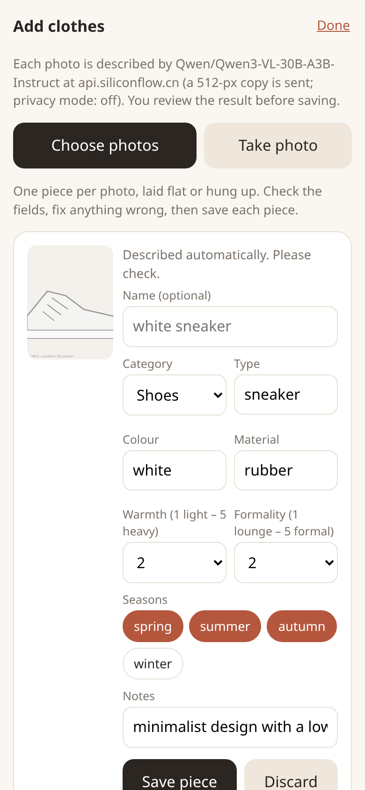

# Today's Outfit

**Your wardrobe, finally in use: it remembers what you wore, rotates the pieces you forget, and picks today's outfit from the clothes you already own.**

  

*Phone-sized screenshots of the real web page, on the bundled **example** wardrobe (drawings) with a **synthetic** 14-day wear history; the forecast and the model pick are real calls made on 2026-10-03. Left to right: the Today card, the wardrobe grid, the Add-clothes form.*

A real run of the same thing on the command line (`todays-outfit --demo today --occasion commute`, full output in [`docs/today_run.txt`](docs/today_run.txt)):

```
Today in Shanghai: 18-23 °C, rain 84%  ->  occasion: commute

  Top pick: white t-shirt + black trousers + brown ankle boots
    Brown ankle boots provide essential waterproofing and warmth for rainy weather. The white t-shirt and black
    trousers create a clean, versatile look that remains stylish yet practical for a wet commute.
    Rotation: Brings back white t-shirt (no wear logged in 14 days). Nothing in it was worn in the last 3 days.
```

The model wrote the first two sentences. The "Rotation:" line is **not** model text: it is computed from the wear log, so it is only ever shown when it is true.

## The problem it targets

This is the problem I set out to solve, stated as a design hypothesis (a starting assumption, not a measurement and not anyone's quote): every morning you stand in front of a full closet, wear the same few favourites, half of the clothes are never worn, picking takes time, and you cannot remember what you wore last time. So the **wardrobe is the hero**, not a one-off question-and-answer box:

1. Your clothes live in the app (photo + editable description), shown as a grid with how long each piece has been sitting unworn.
2. One tap on "Wear this" writes the day into a local history. Nothing else has to be remembered.
3. The page opens on a **Today** card: the day's forecast is fetched automatically, and the pick avoids what you just wore and gently pulls long-unworn pieces back in.

I built it for my wife, from the wardrobe she already has. It is not a shopping app and never suggests buying anything.

<!-- OPTIONAL (owner): add a "## What she said" section here ONLY with her real words, good and bad, after she has tried it. Otherwise leave it out. -->

## What it does

- **Wardrobe grid (main page).** Photos of your pieces, filter by category (tops, bottoms, dresses, outerwear, shoes, other), sort by longest unworn, per-piece wear count and last-worn date, and a badge such as *not worn in 19 days* from 7 days on. Tap a piece to edit or delete it, or to log it as worn today.
- **Add clothes.** On a phone: choose several photos from the gallery, or take one with the camera. A vision model pre-fills category, type, colour, material, warmth, formality, season; **you review and edit every field before saving**. If the privacy mode forbids sending the photo, or the model is unreachable (it waits 45 s), the form simply opens empty for you to fill in. Stored locally: `wardrobe.json` + an `images/` folder. CLI: `todays-outfit add photo1.jpg photo2.jpg`.
- **Wear history.** "Wear this" (or "I wore this today" on any piece) writes `{date, pieces}` into `history.json`. One entry per day; undo is one tap.
- **Rotation.** The style step uses that history (details and measured effect below). It never overrides the weather and dress-code rules.
- **Automatic weather.** Set a city once (Open-Meteo geocoding) or lat/lon in `config.toml`. The page then shows e.g. *Today in Shanghai: 18-23 °C, rain 84%*. You can override it by hand at any time. Offline: it shows the last forecast saved for today, or falls back to typing the temperature. Default with no location: manual.
- **Today card.** Opens straight to today's top pick for the forecast and your last-used occasion. *Wear this* logs it. *Show another* shows the next candidate and remembers that you passed on that exact combination: it is ranked lower for about two weeks (a nudge, not a ban).
- **Still there:** rule filter first, model second, fallback to rules on any failure; three privacy modes; one-line cloud/local switch; the yichu importer.

## Try it

```bash
git clone REPO_URL && cd wardrobe-stylist
./demo.sh        # or: make demo
```

This installs into a local `.venv`, runs the tests, and prints suggestions from the **bundled example wardrobe** (21 synthetic illustrations in `sample_wardrobe/`, with the vision model's real descriptions already cached), including one run on a writable demo copy with a **synthetic** 14-day history so the rotation line shows. It works **offline and without an API key**: with no key the app falls back to the deterministic rules and says so.

```bash
export SILICONFLOW_API_KEY=...             # your own key; the app only ever reads this variable
python -m todays_outfit --demo serve       # the page on http://127.0.0.1:8000 with the example wardrobe + synthetic history (try wearing/adding)
python -m todays_outfit serve              # YOUR wardrobe in ./data (created empty): tap "Add clothes" and photograph what you own
python -m todays_outfit serve --host 0.0.0.0   # reachable from a phone on your LAN (there is no login: only do this on a network you trust)
```

State lives in plain files next to `wardrobe.json` (default `./data/`, git-ignored): `images/`, `history.json`, `settings.json` (last occasion, city), `weather_cache.json`. The bundled `sample_wardrobe/` is read-only: the app refuses to write into it (use `--demo`).

CLI: `todays-outfit today` (auto forecast), `today --temp 14 --rain`, `wear <ids>`, `wardrobe` (last worn / count / badge), `add <photos>`, `suggest --temp 12 --rain --occasion commute [--no-rotation]`.

## How it works (short)

1. **describe**: a vision model turns each photo into JSON (category, type, colour, material, warmth 1-5, formality 1-5, season, notes). Cached by image hash + model in `cache/descriptions.json`. Pieces you add through the app store the *reviewed* fields in `wardrobe.json`; any field there overrides the model's.
2. **filter** (no AI): weather maps to a warmth target; rain removes rain-sensitive shoes; the occasion bounds formality; every outfit is top+bottom or dress, plus shoes, plus an optional outer layer. If a small wardrobe leaves nothing, constraints are relaxed in steps and the result is flagged "loosest match".
3. **rotation** (no AI): the rule-approved candidates are re-scored from the wear log (below). Candidates containing something worn in the last 3 days are kept out of the model's list when at least two clean ones exist.
4. **style**: a text model picks the best 1-3 and writes the reason. Its answer must be valid JSON, point at real candidates, mention only garments in that outfit, and **say nothing about wear history** (it never sees the log; a reason that talks about "yesterday", "haven't worn", "rotation" etc. is dropped). If nothing survives the app falls back to the rule ranking. The *Today* card pads a short model answer with the next rule-ranked outfits (labelled "rules-only pick") so *Show another* always has something to show.

### Rotation, exactly

Scores come from the rules (typical good candidates are within about 1-3 points of each other). Rotation adds: **−2.5** per piece worn today or yesterday, **−1.0** per piece worn 2-3 days ago, up to **+0.5** per piece for being unworn (full bonus at 21 days; a piece never logged counts from when logging began, or when it was added), and up to **−4** for the exact combination you passed on with *Show another*, fading to 0 over 14 days. With no history nothing changes. These weights are my judgement, not tuned on anyone. The sentence under an outfit is built from the log by plain code, e.g. *Brings back black blazer (not worn for 14 days). Nothing in it was worn in the last 3 days.* or *Repeats: black trousers (worn yesterday).*

### Weather, exactly

`https://api.open-meteo.com/v1/forecast` with the day's high, low and maximum precipitation probability (no API key). The rules dress for the **midpoint of low and high** (rounded to 0.5 °C), and "rain" means probability **≥ 50%**; the card shows the raw range and percentage. Cached per location for 3 hours on disk; one retry after a short pause on HTTP 429/5xx; if the network is down the saved forecast for today is shown (labelled), else the page asks you to type the temperature. I verified the real calls on 2026-10-03 (geocoding "Shanghai" and the forecast, output identical to a plain `curl` of the same URL); the other tests use mocked HTTP.

## Does rotation do anything? A simulation, not a study

Simulation on the example wardrobe, rules only (no model, no network), 50 random runs per setting: 14 days of a **made-up** "habit user" (leans on one favourite per category), then 14 more days of random autumn-like weather under three policies that all start from that same history. [`tools/simulate_rotation.py`](tools/simulate_rotation.py) reproduces it exactly; full tables with min-max ranges in [`docs/rotation_simulation.md`](docs/rotation_simulation.md). Means over 50 runs:

| 14 days, 21 pieces | habit user (mild) | habit user (strong) | app top pick, no rotation | app top pick, **with rotation** |
|---|---|---|---|---|
| Pieces worn at least once | 15.9 | 14.7 | 15.0 | **18.8** |
| Most times one piece was worn | 6.8 | 7.8 | 6.9 | **4.1** |
| Piece-days repeated from the previous day | 11.7 | 14.5 | 12.7 | **0.1** |
| Days in an outfit already worn in the window | 2.9 | 3.9 | 5.6 | **0.9** |
| Mean rule score of the outfit worn | 9.8 | 9.8 | 10.2 | 9.6 |

Read it carefully: the "no rotation" arm takes the same best outfit whenever the weather repeats, which is why it repeats so much; one piece (the black flats, which the vision model labelled a belt) was never usable in any run, so 20 of 21 is the ceiling; rotation costs about 0.6 rule-score points on average (the price of not repeating); and the made-up habit user did *not* leave half the closet unworn (it wears 70-76% of the pieces in a fortnight), so this says **nothing** about how much of a real closet sits unused or whether a real person would follow the picks.


## Cloud or local: one line

All model calls go through one OpenAI-compatible client. Copy `config.example.toml` to `config.toml`:

```toml
[llm]
preset = "siliconflow"   # cloud: open-weight Qwen models via SiliconFlow, key read from $SILICONFLOW_API_KEY
# preset = "local"       # Ollama / llama.cpp at http://localhost:11434/v1, no key at all
privacy = "off"          # "off" | "images-local" | "local-only"
```

| Preset | Endpoint | Key | Status in this repo |
|---|---|---|---|
| `siliconflow` | `https://api.siliconflow.cn/v1` | env var `SILICONFLOW_API_KEY` (the config stores only the *name*) | **Tested** end to end |
| `local` | `http://localhost:11434/v1` | none | **Not tested end to end**: no local runtime was available when I built this. The client, the privacy guard and the config switch are unit-tested; I have not measured a local vision model. |

You can mix: e.g. `[vision] preset = "local"` to read photos on your own machine and keep the cloud for the text-only styling step. Any other OpenAI-compatible server works by setting `base_url`, `model` and `api_key_env` in `[vision]` / `[text]`.

### Privacy mode

`--privacy images-local` refuses to send any photo to a non-localhost endpoint (in the Add-clothes form the fields are then filled in by hand). `--privacy local-only` refuses to call any non-localhost endpoint at all (styling then falls back to rules). The check runs before the HTTP request is made; see `tests/test_privacy_config.py` and [`docs/privacy_demo.txt`](docs/privacy_demo.txt) for a real refusal. What goes to the cloud in the default mode: a 512-px JPEG of each photo (once, then cached; photos you add are re-encoded first, which also strips EXIF/GPS) and, per question, a text list of rule-approved outfits plus the weather. The wear history is **not** sent to the model. The forecast is a separate request to open-meteo.com that carries only the city's coordinates (and, once, the city name you typed); under `local-only` it is not made at all. The API key is read from the environment per request and is never logged or stored.

## Models I measured

Everything below was measured on my run on **2026-10-03 (Beijing time)** against SiliconFlow, on the 21 bundled illustrations, one request at a time. Ground truth is what I drew (`sample_wardrobe/ground_truth.json`). Reproduce with `python tools/eval_describe.py` and `tools/eval_style.py` (needs a key); raw data in [`docs/`](docs/).

**Vision (photo → JSON), 21 photos each**

| Model | median s / photo | p90 s | category | type | colour | warmth ±1 | formality ±1 |
|---|---|---|---|---|---|---|---|
| Qwen/Qwen3-VL-8B-Instruct | 3.1 | 4.0 | 81% | 76% | 90% | 67% | 86% |
| **Qwen/Qwen3-VL-30B-A3B-Instruct** (default) | 4.4 | 5.0 | 90% | 81% | 100% | 100% | 90% |
| Qwen/Qwen3-VL-32B-Instruct | 6.0 | 8.5 | 95% | 71% | 95% | 90% | 86% |
| zai-org/GLM-4.5V | 9.2 | 14.2 | 90% | 81% | 95% | 90% | 86% |

I picked 30B-A3B: best warmth/colour numbers and only ~1.3 s slower than the 8B. The 8B was fastest but, for example, called a black ballet flat a hoodie. No model had a failed or unparsable call in this run. I did not look up per-token prices, so I make no cost claim. Mean latency was 5.6 s per photo (some slow outliers above the 4.4 s median). Describing all 21 photos took 94 s with 4 parallel workers versus 118 s for the same 21 one at a time, so parallelism helped only ~20% (the service seemed to throttle concurrent requests; not investigated).

**Text (pick + explain), 5 scenarios each**

| Model | valid answers | median s | note |
|---|---|---|---|
| **Qwen/Qwen3.6-35B-A3B**, thinking off (default) | 5/5 | 2.5 | |
| Qwen/Qwen3.5-27B, thinking off | 5/5 | 11.9 | |
| Qwen/Qwen3.6-35B-A3B, thinking on | 4/5 | 22.4 | one unusable answer, cause not diagnosed |
| Qwen/Qwen3.5-27B, thinking on | 0/2 | n/a | both calls hit my 180 s timeout; stopped |

A whole `suggest` call (rules + one model request) took about 3 s wall-clock (four runs in 11-12 s).

## Honest limitations

- **Everything measured is on synthetic data.** The 21 example "clothes" are my drawings, the 14-day histories are generated, and the rotation numbers are a simulation with a made-up habit user who always accepts the top pick. No real wardrobe, photo set or person has been measured. Real flat-lays and phone photos are harder than my drawings; expect lower accuracy.
- **The pain point is a hypothesis.** "Half the closet is never worn, picking takes time, can't remember what was worn" is what the design assumes. I have no data that it holds for any particular person, and I do not claim that the app fixes it.
- **The vision model misreads things.** On the example set it called the denim jacket and the trench coat "blazers", the black flats "a belt" (so they are never used) and the tan suede loafers "a brown sandal". Mis-categorised pieces silently drop out or land in odd combinations. That is why the Add form shows every field for editing and every field can be overridden in `wardrobe.json`. During this build the vision endpoint was slow at times (a single photo took about 14 s once, and one real end-to-end test hit its 120 s timeout and passed on a rerun); the Add form therefore gives up after 45 s and lets you type.
- **Language-model reasons are fluent, not guaranteed true.** Material words ("silk", "waterproof") are guesses. The grounding check only catches garments named in a reason that are not in the outfit, and the history check only catches a fixed list of phrases; neither checks taste. (The first screen's example says ankle boots "provide waterproofing": that is the model's claim, not verified.)
- **The rules still have little taste.** They respect weather and dress code but accepted khaki shorts with a jacket at 14 °C and once paired a shirt with shorts and heels for a date.
- **Rotation only knows what you tap.** If you do not log a day, the log is wrong, and "not worn in N days" with it. A piece that has never been logged is dated from when logging began.
- **The weights and thresholds are untuned** (rotation penalties, 50% rain threshold, 7-day badge, midpoint temperature) and fixed in code, not settings.
- **No login, one user.** Anyone who can reach the port can read and change the wardrobe; the default binds to localhost.
- **Tested in headless Chrome and with mocked/real HTTP, not on a real phone.** The camera button is a plain `<input type=file capture>`; I have not seen it on a device.
- **Local models: untested here** (see the table above). The Open-Meteo free tier is rate-limited (I got a 429 once while taking screenshots; the retry and the manual fallback exist because of it).
- The yichu importer's default table and column names are guesses and have **not** been run against a real yichu database.

## Bring your own wardrobe

Normally: `python -m todays_outfit serve`, tap **Add clothes**, or `todays-outfit add photos/*.jpg`. `wardrobe.json` is plain JSON, `{"items": [{"id": "...", "image": "images/x.jpg", "category": "top", "type": "t-shirt", "color": "white", ...}]}`; an item that only has `id` and `image` gets its fields from the cached vision description, and any field you write overrides it (`"warmth": 4`, `"name": "Mum's camel coat"`). To import from a "yichu"-style self-hosted wardrobe app (FastAPI + SQLite + uploads folder, which is my own), see [`src/todays_outfit/sources/yichu.py`](src/todays_outfit/sources/yichu.py):

```bash
python -m todays_outfit import-yichu --db db.sqlite --uploads ./uploads --table items --image-col image_path --out my/wardrobe.json
python -m todays_outfit --wardrobe my/wardrobe.json describe
```

The database is opened read-only; photos are referenced in place (deleting such a piece in the app never deletes the original photo; only photos the app stored itself in `images/` are removed). For this contest I did not use any private photos and the adapter is tested only with a synthetic SQLite file.

## Tests

`pytest` runs 102 offline tests (rule filter, JSON parsing, grounding and history-claim checks, fallback paths, privacy guard, config switch, importer, wear history, rotation, simulation, weather with mocked HTTP incl. cache/offline/429, photo re-encoding, add/edit/delete, CLI, web API incl. upload and read-only mode) plus 2 real SiliconFlow end-to-end tests that are skipped without a key. Last run: **104 passed** (log: [`docs/test_run.txt`](docs/test_run.txt)). About 4,600 lines of Python and HTML including tests and tools. The end-to-end run on the sample wardrobe that produced `docs/examples.txt` and `docs/describe_run.txt` used the real service; `docs/today_run.txt` and the three screenshots come from `tools/screenshots.py` / a real `today` run (real Open-Meteo, real model).

## Credits and license

- Written during the **Hacktoberfest Weekend Challenge: Build for a Friend**; built Oct 3-5 2026 (first commit 2026-10-03 18:23 Beijing time, within the challenge window).
- Models: Qwen3-VL and Qwen3.5/3.6 (Alibaba Qwen team) and GLM-4.5V (Z.ai), open-weight, served by SiliconFlow for my measurements.
- Libraries: [FastAPI](https://fastapi.tiangolo.com/), [Uvicorn](https://www.uvicorn.org/), [httpx](https://www.python-httpx.org/), [Pillow](https://python-pillow.org/), [pytest](https://pytest.org/). No code was copied from other projects; the rule table and prompts are mine.
- Example clothes are my own Pillow drawings (`tools/make_sample_wardrobe.py`), labelled "EXAMPLE DATA".
- The code was written with the help of an AI coding agent under my direction.
- License: MIT (see `LICENSE`).

### Commits after the deadline

The submission deadline is 2026-10-05 06:59 UTC (14:59 Beijing). **No commits after the deadline so far.** If any are made, they are listed here:

- _(none)_