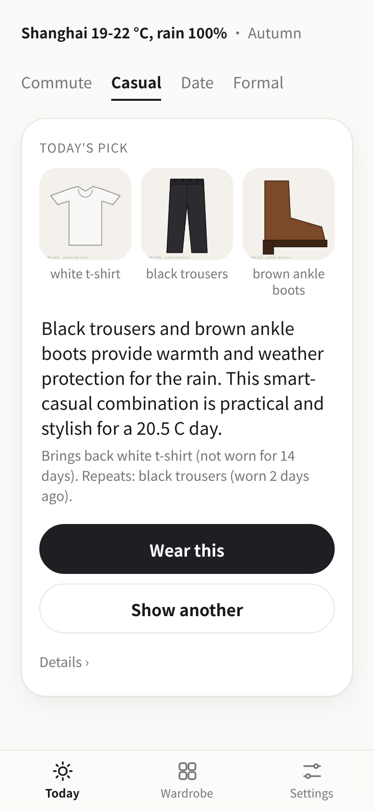
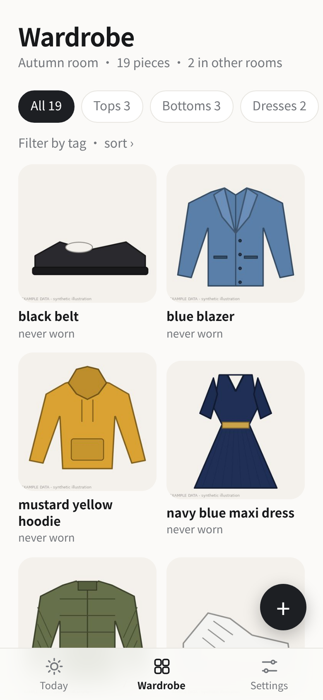
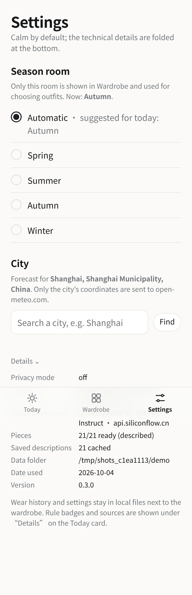
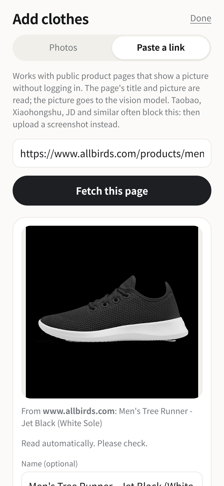

# Dresser

Dresser, a private wardrobe that picks today's outfit so you don't have to think.

It remembers what you wore, rotates the pieces you forget, and picks only from the clothes you already own.

<p>
 
 

</p>
<p> Paste a link: a real public product page (Allbirds) read, picture shown, fields pre-filled for review"></p>

*Phone-sized screenshots of the real web page (headless Chrome, 390 px wide) on the bundled **example** wardrobe (drawings) with an generated two-week wear log. The forecast, the model pick and the product-page import are real calls made on 2026-10-04 (the screenshot run's pick differs from the command-line run below: the model's choice varies from run to run). Left to right: Today, Wardrobe (Autumn room), Settings (Details opened), and Add clothes > Paste a link on a real public shop page.*

A real run on the command line (2026-10-04, `dresser --demo today --occasion casual`; all runs, unedited, in [`docs/today_run.txt`](docs/today_run.txt)). It rains all day, and the rain rule keeps canvas and suede shoes out, which is why the example wardrobe's yellow rain boots are picked:

```
Today in Shanghai: 19-22 °C, rain 100%  ->  occasion: casual, room: autumn

  Top pick: white t-shirt + blue jeans + yellow rain boots
    Yellow rain boots keep your feet dry in the rain, while the white tee and blue jeans offer a relaxed, casual vibe perfect for the mild 20.5°C weather.
    Rotation: Nothing in it was worn in the last 3 days.

  Alternative 1: white t-shirt + blue jeans + brown ankle boots
    Right weight for 20.5 °C and within the casual dress code; no rain-sensitive shoes; tagged for this occasion (rule-based pick).
    Rotation: Nothing in it was worn in the last 3 days.
```

The model wrote the reason. The "Rotation:" line is **not** model text: it is computed from the wear log, so it is only ever shown when it is true.

## Where it comes from

My wife is the everyday user of a wardrobe app (yichu) that I built for her earlier; we designed it together. This repository is **Dresser**, newly written for this challenge. The original app is only the inspiration and the source of the requirements; no code or private data from it is in this repo.

## The problem it targets

This is the problem Dresser is designed around. It is an assumption I started from, not a measurement and not anyone's quote: every morning you stand in front of a full closet, wear the same few favourites, many of the clothes stay unworn, picking takes time, and you cannot remember what you wore last time. So the **wardrobe is the centre**, not a one-off question-and-answer box:

1. Your clothes live in the app (photo + editable description), shown as a grid with how long each piece has been sitting unworn.
2. One tap on "Wear this" writes the day into a local history. Nothing else has to be remembered.
3. The page opens on a **Today** card: the day's forecast is fetched automatically, and the pick avoids what you just wore and gently pulls long-unworn pieces back in.

It is not a shopping app and never suggests buying anything.

## What it does

The app is one calm column with three tabs. Everything that is not about choosing clothes (model names, endpoints, privacy mode, "N/N ready", cache, rule/source badges) is folded behind a small **Details** link on the Today card and listed in full under **Settings**.

- **Today.** A quiet weather line on top (*Shanghai 19-22 °C, rain 100% · Autumn*; tap it to override the temperature or rain by hand), four occasion words (commute, casual, date, formal), and one card: the day's pick with a one-sentence reason, one computed rotation line, **Wear this** and **Show another**. *Wear this* writes the day to `history.json` (undo is one tap). *Show another* shows the next candidate and remembers that you passed on that exact combination (ranked lower for about two weeks, a nudge not a ban).
- **Wardrobe.** The *current season room* only (below): a two-column grid with the quiet text "not worn in N days", category pills, a collapsible tag filter and sort. Tap a piece to edit it (fields, rooms, tags), log it as worn today, or delete it. The round **+** opens Add clothes.
- **Add clothes.** **Photos**: choose several from the gallery or take one; a vision model pre-fills category, type, colour, material, warmth, formality; **you review every field before saving**. **Paste a link**: a public product page (below). If the privacy mode forbids sending the photo, or the model is unreachable (the form waits 75 s), the form opens with whatever could be filled in and you type the rest. CLI: `dresser add photo1.jpg photo2.jpg`.
- **Settings.** Season room (Automatic, or Spring/Summer/Autumn/Winter), city for the automatic forecast, and the folded Details (privacy mode, models and hosts, pieces ready, cache, data folder, version).
- **Automatic weather.** Set a city once (Open-Meteo geocoding). Offline it shows the last forecast saved for today, or asks you to type a temperature. Still the *input* to the pick inside the room.
- **Still there:** rule filter first, model second, fallback to rules on any failure; three privacy modes; one-line cloud/local switch; the yichu importer.

### Four season rooms

The wardrobe is split into Spring, Summer, Autumn and Winter rooms, like the old yichu app that kept winter and summer apart. **Only the current room is shown in Wardrobe and used for choosing outfits**; switching the season in Settings switches the room (the other pieces are still there, the Wardrobe header says "N in other rooms").

- **Which room is current:** *Automatic* by default, suggested from today's date (meteorological seasons: Mar-May spring, Jun-Aug summer, Sep-Nov autumn, Dec-Feb winter), flipped when your city's latitude is negative (southern hemisphere; with no city it assumes north). Or pick a season yourself; that choice is saved and wins until you set Automatic again. CLI: `dresser season [spring|summer|autumn|winter|auto]`, `--season X` or `--season all` on `today`, `suggest`, `wardrobe`.
- **Which rooms a piece is in:** from warmth, by a fixed rule table, then two keyword overrides. A piece can be in several rooms; you can edit the rooms of every piece.

| Warmth (1 light - 5 heavy) | Rooms |
|---|---|
| 1 | spring, summer |
| 2 | spring, summer, autumn |
| 3 | spring, autumn, winter (+ summer for bottoms, dresses, shoes) |
| 4 | autumn, winter |
| 5 | winter |
| type/name has *shorts, sandal, sundress, tank, camisole, swim, sleeveless* | spring, summer only |
| type/name has *coat, parka, puffer, padded, fleece, thermal, scarf, beanie, glove* | autumn, winter only |

The vision model's own "season" guess is deliberately ignored: the rooms follow this table so they are predictable and testable. On the 21 example pieces this gives Spring 18, Summer 13, Autumn 19, Winter 13 pieces. The table is my judgement, not tuned on any real closet.

### Auto tags

Every piece gets suggested tags (lowercase words such as `work`, `casual`, `rain-ready`, `layering`, `neutral`).

1. **Stage 1, deterministic, always on** ([`tags.py`](src/dresser/tags.py)): from formality (1-2 `casual`, 3 `smart-casual`, 4-5 `work`, 5 `formal`, dresses/heels/skirts at 4+ `dressy`), rain rules (rain-proof shoes and outer layers `rain-ready`; suede/canvas-type shoes `not-for-rain`), category/type (`layering` for outer layers, cardigans, hoodies...), colour (`neutral` or `colourful`), warmth (`warm` at 4+, `light`), material/look (`denim`, `knit`, `wool`, `leather`, `linen`, `silk`, `cotton`, `sporty`).
2. **Stage 2, optional model suggestions:** on the piece's form, **More ideas from the model** asks the text model for up to 5 *new* short tags (never repeating stage 1). They appear as dashed chips; tap to accept, tap an accepted chip to remove it; you can also type your own. Stage 2 respects the privacy mode and never runs unless you ask.
3. **Use:** filter the Wardrobe by tag. The style step uses tags lightly: a piece tagged for the chosen occasion (`work` for commute, `casual`, `dressy` for date, `formal`) adds +0.25 to an outfit's rule score (at most +1.0 per outfit), and the first six tags go into the model's prompt. Tags never override the weather or dress-code rules.

### Paste a product link

In **Add clothes > Paste a link**: the server fetches the public page, reads `og:image`, `og:title`, `og:description` and any JSON-LD `Product` data (name, colour, material, images), downloads the main picture, sends that picture (plus the page title as a hint) to the vision model, and opens the usual review form pre-filled. You edit, then save. The page's title becomes the piece's name.

- **Privacy:** `local-only` refuses outright (no web request is made); `images-local` fetches the page but does not send the picture to a cloud vision model: the fields are filled from the page title by simple keyword rules and the form says so. If the vision model times out, the same title-only fallback applies.
- **Safety:** only `http`/`https`, ports 80/443/8080/8443, no credentials in the URL; the host is resolved and every address must be public (loopback, private, link-local, multicast, reserved and IPv4-mapped IPv6 are refused); each redirect (at most 4) is re-checked; 10 s timeout, 2 MB page cap, 12 MB picture cap; honest user agent (`Dresser/0.3 ... single page fetch`), no cookies, no login, no JavaScript. Known gap: the address is checked and then the HTTP client resolves again, so a malicious DNS server could in theory answer differently the second time (DNS rebinding). For a single-user app on localhost I accepted that; do not expose this endpoint to untrusted users.
- **It only works on pages that put the product picture in the HTML.** Real attempts on 2026-10-03 from my machine (all 16 URLs, one row each with the reason, are in [`docs/link_import_probe.md`](docs/link_import_probe.md); the raw output of the last probe is in [`docs/link_import_run.txt`](docs/link_import_run.txt); reproduce with `tools/link_import_probe.py URL...`):

| Page | Result |
|---|---|
| allbirds.com (Tree Runner) | worked: title, picture, fields (shoes / sneaker / black) in 16 s with the vision model |
| everlane.com (Box-Cut Tee) | worked: top / t-shirt / white / cotton, 14 s |
| uniqlo.com/jp (crew-neck T-shirt) | worked: top / t-shirt / light gray / cotton, 18 s (the .com/us page timed out from my network) |
| nike.com (Air Force 1) | worked: shoes / sneakers / white / leather, 21 s |
| zara.com | refused by the shop: HTTP 403 |
| patagonia.com | page loads but has no picture in the HTML: "build the page with JavaScript" message |
| taobao.com / tmall.com | no product picture in the HTML (JavaScript or login): clear message, upload a screenshot instead |
| xiaohongshu.com | an invented note id returned a "page gone" page whose only picture is a 4.5 KB logo: rejected as "tiny, not a product photo". **I did not have a real Xiaohongshu post link, so a real post is untested.** |
| muji.com, gap.com, l.l.bean, asos.com, uniqlo.com/us, hm.com, bonobos.com | HTTP 403 / no picture in HTML / no answer within 10 s from my network / my box's DNS answered a blocked address (H&M) / my guessed URL was a 404 (Bonobos); none usable |

So: simple server-rendered shops work; big chains and the Chinese marketplaces mostly do not. When it fails the sheet shows the reason and an **Upload a picture instead** button. The page title also becomes the name, which is often a long marketing string ("The Box-Cut Tee in Essential Cotton | White | No Pocket - XXS"): shorten it in the form.

## Try it

```bash
git clone https://github.com/wubian87/dresser && cd dresser
./demo.sh        # or: make demo
```

This installs into a local `.venv`, runs the tests, and prints suggestions from the **bundled example wardrobe** (21 drawn illustrations in `sample_wardrobe/`, with the vision model's real descriptions already cached; the demo history is made from the current season room), including one run on a writable demo copy with a **generated** 14-day history so the rotation line shows. It works **offline and without an API key**: with no key the app falls back to the deterministic rules and says so.

```bash
export SILICONFLOW_API_KEY=...             # your own key; the app only ever reads this variable
python -m dresser --demo serve       # the page on http://127.0.0.1:8000 with the example wardrobe + generated history (try wearing/adding)
python -m dresser serve              # YOUR wardrobe in ./data (created empty): open Wardrobe, tap + and photograph what you own (or paste a product link)
python -m dresser serve --host 0.0.0.0   # reachable from a phone on your LAN (there is no login: only do this on a network you trust)
```

State lives in plain files next to `wardrobe.json` (default `./data/`, git-ignored): `images/`, `history.json`, `settings.json` (last occasion, city), `weather_cache.json`. The bundled `sample_wardrobe/` is read-only: the app refuses to write into it (use `--demo`).

CLI: `dresser today` (auto forecast), `today --temp 14 --rain`, `wear <ids>`, `wardrobe` (current room; last worn / count / badge), `season [name|auto]`, `add <photos>`, `suggest --temp 12 --rain --occasion commute [--season autumn|--season all] [--no-rotation]`.

## How it works (short)

1. **describe**: a vision model turns each photo into JSON (category, type, colour, material, warmth 1-5, formality 1-5, season, notes). Cached by image hash + model in `cache/descriptions.json`. Pieces you add through the app store the *reviewed* fields in `wardrobe.json`; any field there overrides the model's.
2. **filter** (no AI): weather maps to a warmth target; rain removes rain-sensitive shoes; the occasion bounds formality; every outfit is top+bottom or dress, plus shoes, plus an optional outer layer. If a small wardrobe leaves nothing, constraints are relaxed in steps and the result is flagged "loosest match".
3. **rotation** (no AI): the rule-approved candidates are re-scored from the wear log (below). Candidates containing something worn in the last 3 days are kept out of the model's list when at least two clean ones exist.
4. **style**: a text model picks the best 1-3 and writes the reason. Its answer must be valid JSON, point at real candidates, mention only garments in that outfit, and **say nothing about wear history** (it never sees the log; a reason that talks about "yesterday", "haven't worn", "rotation" etc. is dropped). If nothing survives the app falls back to the rule ranking. The *Today* card pads a short model answer with the next rule-ranked outfits (labelled "rules-only pick") so *Show another* always has something to show.

### Rotation, exactly

Scores come from the rules (typical good candidates are within about 1-3 points of each other). Rotation adds: **−2.5** per piece worn today or yesterday, **−1.0** per piece worn 2-3 days ago, up to **+0.5** per piece for being unworn (full bonus at 21 days; a piece never logged counts from when logging began, or when it was added), and up to **−4** for the exact combination you passed on with *Show another*, fading to 0 over 14 days. With no history nothing changes. These weights are my judgement, not tuned on anyone. The sentence under an outfit is built from the log by plain code, e.g. *Brings back black blazer (not worn for 14 days). Nothing in it was worn in the last 3 days.* or *Repeats: black trousers (worn yesterday).*

### Weather, exactly

`https://api.open-meteo.com/v1/forecast` with the day's high, low and maximum precipitation probability (no API key). The rules dress for the **midpoint of low and high** (rounded to 0.5 °C), and "rain" means probability **≥ 50%**; the card shows the raw range and percentage. Cached per location for 3 hours on disk; one retry after a short pause on HTTP 429/5xx; if the network is down the saved forecast for today is shown (labelled), else the page asks you to type the temperature. I re-checked the real calls on 2026-10-04 (geocoding "Shanghai" and the forecast; the app's numbers equal a plain `httpx` request and a `curl` of the same URL, see [`docs/weather_check.md`](docs/weather_check.md), reproduce with `tools/weather_check.py`); the other tests use mocked HTTP.

## Does rotation do anything? A simulation, not a study

Simulation on the **autumn room** of the example wardrobe (19 of the 21 pieces; the simulated weather is autumn-like and the app only styles from the current room), rules only (no model, no network), 50 random runs per setting: 14 days of a **simulated** "habit user" (leans on one favourite per category), then 14 more days of random autumn-like weather under three policies that all start from that same history. [`tools/simulate_rotation.py`](tools/simulate_rotation.py) reproduces it exactly; full tables with min-max ranges in [`docs/rotation_simulation.md`](docs/rotation_simulation.md). Means over 50 runs (the small occasion-tag nudge is included since tags are on by default):

| 14 days, 19 pieces | habit user (mild) | habit user (strong) | app top pick, no rotation | app top pick, **with rotation** |
|---|---|---|---|---|
| Pieces worn at least once | 14.3 | 13.3 | 13.0 | **16.7** |
| Most times one piece was worn | 7.7 | 9.0 | 7.8 | **4.3** |
| Piece-days repeated from the previous day | 14.0 | 16.9 | 17.0 | **0.2** |
| Days in an outfit already worn in the window | 3.7 | 5.0 | 6.5 | **1.6** |
| Mean rule score of the outfit worn | 10.3 | 10.3 | 10.7 | 10.0 |

Read it carefully: the "no rotation" arm takes the same best outfit whenever the weather repeats, which is why it repeats so much; one piece (the black flats, which the vision model labelled a belt) was never usable in any run, so 18 of 19 is the ceiling; rotation costs about 0.7 rule-score points on average (the price of not repeating); and the simulated habit user wore 70-75% of the pieces in a fortnight anyway (weather and the rules already force some variety), so this says **nothing** about how much of a real closet sits unused or whether a real person would follow the picks. (The with-rotation column is the mild-habit run; the strong-habit run gave 16.8 / 4.3 / 0.2 / 1.5.)


## Cloud or local: one line

All model calls go through one OpenAI-compatible client. Copy `config.example.toml` to `config.toml`:

```toml
[llm]
preset = "siliconflow"   # cloud: open-weight Qwen models via SiliconFlow, key read from $SILICONFLOW_API_KEY
# preset = "local"       # Ollama / llama.cpp at http://localhost:11434/v1, no key at all
privacy = "off"          # "off" | "images-local" | "local-only"
```

| Preset | Endpoint | Key | Status in this repo |
|---|---|---|---|
| `siliconflow` | `https://api.siliconflow.cn/v1` | env var `SILICONFLOW_API_KEY` (the config stores only the *name*) | **Tested** end to end |
| `local` | `http://localhost:11434/v1` | none | **Not tested end to end**: no local runtime was available when I built this. The client, the privacy guard and the config switch are unit-tested; I have not measured a local vision model. |

You can mix: e.g. `[vision] preset = "local"` to read photos on your own machine and keep the cloud for the text-only styling step. Any other OpenAI-compatible server works by setting `base_url`, `model` and `api_key_env` in `[vision]` / `[text]`.

### Privacy mode

`--privacy images-local` refuses to send any photo to a non-localhost endpoint (in the Add-clothes form the fields are then filled in by hand). `--privacy local-only` refuses to call any non-localhost endpoint at all (styling then falls back to rules). The check runs before the HTTP request is made; see `tests/test_privacy_config.py` and [`docs/privacy_demo.txt`](docs/privacy_demo.txt) for a real refusal. What goes to the cloud in the default mode: a 512-px JPEG of each photo (once, then cached; photos you add are re-encoded first, which also strips EXIF/GPS) and, per question, a text list of rule-approved outfits plus the weather. The wear history is **not** sent to the model. The forecast is a separate request to open-meteo.com that carries only the city's coordinates (and, once, the city name you typed); under `local-only` it is not made at all. The API key is read from the environment per request and is never logged or stored.

## Models I measured

Everything below was measured on my run on **2026-10-03 (Beijing time)** against SiliconFlow, on the 21 bundled illustrations, one request at a time. Ground truth is what I drew (`sample_wardrobe/ground_truth.json`). Reproduce with `python tools/eval_describe.py` and `tools/eval_style.py` (needs a key); raw data in [`docs/`](docs/).

**Vision (photo → JSON), 21 photos each**

| Model | median s / photo | p90 s | category | type | colour | warmth ±1 | formality ±1 |
|---|---|---|---|---|---|---|---|
| Qwen/Qwen3-VL-8B-Instruct | 3.1 | 4.0 | 81% | 76% | 90% | 67% | 86% |
| **Qwen/Qwen3-VL-30B-A3B-Instruct** (default) | 4.4 | 5.0 | 90% | 81% | 100% | 100% | 90% |
| Qwen/Qwen3-VL-32B-Instruct | 6.0 | 8.5 | 95% | 71% | 95% | 90% | 86% |
| zai-org/GLM-4.5V | 9.2 | 14.2 | 90% | 81% | 95% | 90% | 86% |

I picked 30B-A3B: best warmth/colour numbers and only ~1.3 s slower than the 8B. The 8B was fastest but, for example, called a black ballet flat a hoodie. No model had a failed or unparsable call in this run. I did not look up per-token prices, so I make no cost claim. Mean latency was 5.6 s per photo (some slow outliers above the 4.4 s median). Describing all 21 photos took 94 s with 4 parallel workers versus 118 s for the same 21 one at a time, so parallelism helped only ~20% (the service seemed to throttle concurrent requests; not investigated).

**Text (pick + explain), 5 scenarios each**

| Model | valid answers | median s | note |
|---|---|---|---|
| **Qwen/Qwen3.6-35B-A3B**, thinking off (default) | 5/5 | 2.5 | |
| Qwen/Qwen3.5-27B, thinking off | 5/5 | 11.9 | |
| Qwen/Qwen3.6-35B-A3B, thinking on | 4/5 | 22.4 | one unusable answer, cause not diagnosed |
| Qwen/Qwen3.5-27B, thinking on | 0/2 | n/a | both calls hit my 180 s timeout; stopped |

A whole `suggest` call (rules + one model request) took about 3 s wall-clock (four runs in 11-12 s).

## Limitations

- **Measured on example data only.** The 21 example clothes are my drawings, the 14-day histories are generated, and the rotation numbers come from a simulation in which a simulated user always accepts the top pick. Real phone photos are harder than drawings, so expect lower accuracy.
- **The problem statement is an assumption.** I have no data that "many clothes stay unworn and picking takes time" holds for any particular person, and I do not claim the app fixes it.
- **The vision model misreads things.** On the example set it called the denim jacket and the trench coat "blazers", the black flats "a belt" (so they are never used) and the tan suede loafers "a brown sandal". That is why the Add form shows every field for editing. The vision endpoint was sometimes slow (14-30 s for one photo, and one end-to-end test hit its 120 s timeout once); the form gives up after 75 s and lets you type.
- **Model reasons are fluent, not guaranteed true.** Material words ("silk", "waterproof") are guesses. The checks only catch garments that are not in the outfit and a fixed list of history phrases; they do not judge taste.
- **The rules have little taste.** They respect weather and dress code but accepted khaki shorts with a jacket at 14 °C and once paired a shirt with shorts and heels for a date. Season rooms, tags and all weights and thresholds are rules I wrote, fixed in code and untuned.
- **Rotation only knows what you tap.** If you do not log a day, the log (and "not worn in N days") is wrong.
- **Link import is narrow.** It reads only what a shop puts in its HTML; many shops answer 403 or need JavaScript or a login (4 of the 16 pages I tried worked; see the table above). DNS rebinding is not fully mitigated (see above).
- **Tested on one real phone, with gaps.** I ran the page on a Samsung phone (Chrome, dark mode) in rules-only mode, so model-written text was not tried on the phone; photo upload, the camera button and light mode were not tried there. Other tests ran in headless Chrome and with mocked or real HTTP.
- **Local models: untested** (see the table above). The Open-Meteo free tier is rate-limited (I got one 429); the retry and the manual fallback exist because of it.
- **No login, one user.** Anyone who can reach the port can read and change the wardrobe; the default binds to localhost.
- The yichu importer's default table and column names are guesses and have not been run against a real yichu database.

## Bring your own wardrobe

Normally: `python -m dresser serve`, tap **+** in Wardrobe, or `dresser add photos/*.jpg`. `wardrobe.json` is plain JSON, `{"items": [{"id": "...", "image": "images/x.jpg", "category": "top", "type": "t-shirt", "color": "white", ...}]}`; an item that only has `id` and `image` gets its fields from the cached vision description, and any field you write overrides it (`"warmth": 4`, `"name": "Mum's camel coat"`). To import from a "yichu"-style self-hosted wardrobe app (FastAPI + SQLite + uploads folder; it is the app I wrote earlier for my wife), see [`src/dresser/sources/yichu.py`](src/dresser/sources/yichu.py):

```bash
python -m dresser import-yichu --db db.sqlite --uploads ./uploads --table items --image-col image_path --out my/wardrobe.json
python -m dresser --wardrobe my/wardrobe.json describe
```

The database is opened read-only; photos are referenced in place (deleting such a piece in the app never deletes the original photo; only photos the app stored itself in `images/` are removed). For this contest I did not use any private photos and the adapter is tested only with a generated SQLite file.

## Tests

`pytest` runs 207 offline tests (rule filter, JSON parsing, grounding and history-claim checks, fallback paths, privacy guard, config switch, importer, wear history, rotation, simulation, weather with mocked HTTP incl. cache/offline/429, photo re-encoding, add/edit/delete, CLI, web API incl. upload and read-only mode, **season rooms** (date/hemisphere, rule table, room filtering of the grid and of styling, saved override), **tags** (stage-1 table, junk input, occasion nudge, stage 2 with mocked models: parse, dedupe, failure, privacy), **link import** with mocked shop pages (og/JSON-LD parsing, redirects, size cap, 403/404/429/login/JS-only pages, tiny-logo rejection, 25 SSRF cases, privacy modes, title-only fallback, API errors) and the structure of the page) plus 3 real SiliconFlow end-to-end tests (describe a photo, style an outfit, suggest tags) that are skipped without a key. Last run (2026-10-04, fresh clone, with a SiliconFlow key): **210 passed** (207 offline + the 3 real ones; log: [`docs/test_run.txt`](docs/test_run.txt)); without a key the 3 real tests are skipped and the run is 207 passed, 3 skipped. A slow vision endpoint once made the real describe test fail on a 120 s timeout, which is why that test now waits up to 170 s and retries once. About 6,300 lines of Python and HTML including tests and tools. `docs/examples.txt`, `docs/today_run.txt`, `docs/link_import_run.txt` and the four screenshots come from real runs (real Open-Meteo, real models, real shop pages); `tools/screenshots.py` and `tools/link_import_probe.py` reproduce them.

## Credits and license

- Written during the **Hacktoberfest Weekend Challenge: Build for a Friend**; built Oct 3-5 2026 (first commit 2026-10-03 18:23 Beijing time, within the challenge window).
- Models: Qwen3-VL and Qwen3.5/3.6 (Alibaba Qwen team) and GLM-4.5V (Z.ai), open-weight, served by SiliconFlow for my measurements.
- Libraries: [FastAPI](https://fastapi.tiangolo.com/), [Uvicorn](https://www.uvicorn.org/), [httpx](https://www.python-httpx.org/), [Pillow](https://python-pillow.org/), [pytest](https://pytest.org/). No code was copied from other projects; the rule table and prompts are mine.
- Example clothes are my own Pillow drawings (`tools/make_sample_wardrobe.py`), labelled "EXAMPLE DATA".
- The code was written with the help of an AI coding agent under my direction.
- License: MIT (see `LICENSE`).

### Commits after the deadline

The submission deadline is 2026-10-05 06:59 UTC (14:59 Beijing). **No commits after the deadline so far.** If any are made, they are listed here:

- _(none)_